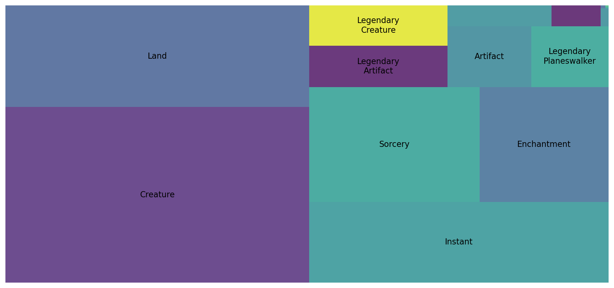
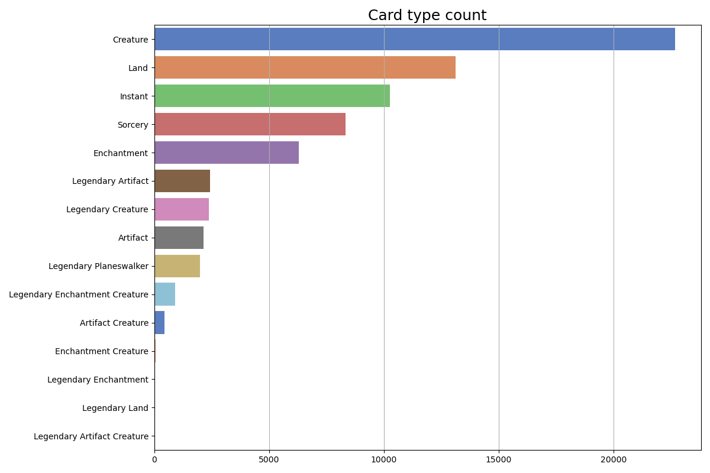

# :deciduous_tree::fire::skull::droplet::sunny: MTG decklist scrapper :sunny::droplet::skull::fire::deciduous_tree:
 A Magic the Gathering deck scrapper for the [magic](magic.gg) and [mtgmelee](mtgmelee.com) websites using the [scryfall API](https://scryfall.com/docs/api).
 
 Project structure was created with [this ETL blueprint](https://github.com/aguiarandre/etl-pipelines).
 
## :floppy_disk: Data
### :leftwards_arrow_with_hook: Extraction
Data is scraped from the websites using Selenium with headless Chrome and stored in the data/raw folder as it is, tagging it by site and tournament.
### :arrows_counterclockwise: Transform
Normalize the data into json files at data/processed with the same format and add data retrieved from the scryfall API (prices, image, etc.).
### :arrow_heading_up: Load
Load each deck and card from the json files into the postgreSQL database.
## :bar_chart: Visualization
Expose statistics of the given decks and its card attributes

# Analysis

## Metagame
The goal of this project is to analyze the common factors among the top 16 winner decks in different tournaments with more than 64 players registered. Card properties like type, set, colors, prices, mana cost and others are the ones provided by the Scryfall API.

*Limitation note: currently the prices are obtained at the moment of the data extraction.*

### Color distribution

|  |
|:--:|
| *Color count among decks* |

As most players know, the green color has been being pushed by the design team of Wizards of the Coast for quite some time in Standard format now, and in second place the red color makes an appearance, maybe together in the same decks?

:bulb: *Red and green decks are popular.*

|  |
|:--:|
| *Card frequency in all the registered tournaments* |

|  |
|:--:|
| *Card frequency in all the registered tournaments* |

The most popular card is the red [Bonecrusher Giant](https://scryfall.com/card/eld/115/bonecrusher-giant-stomp) with 1505 appearances in 37887 cards, followed by [Lovestruck Beast](https://scryfall.com/card/eld/165/lovestruck-beast-hearts-desire) and [Edgewall Inkeeper](https://scryfall.com/card/eld/151/edgewall-innkeeper), both green cards with 1000 and 1100 appearances. In a fourth place comes the red-green [Brushfire Elemental](https://scryfall.com/card/znr/221/brushfire-elemental) with 848 and [Embercleave](https://scryfall.com/card/eld/120/embercleave) in fifth with 815, being the last one above 800.

### Type distribution
|  | 
|:--:|
| *Card types count in all tournaments* |

|  |
|:--:|
| *Card types count in all tournaments* |

From 51552 cards registered in tournaments, 16229 were creatures, 9160 nonbasic lands, 7879 instants, 6215 sorceries and 4496 enchantments, with other types below the 2000 each.

:bulb: *This gives a clear picture that agresive decks are abundant.*

### Set distribution

### Rarity distribution

## Winner decks
